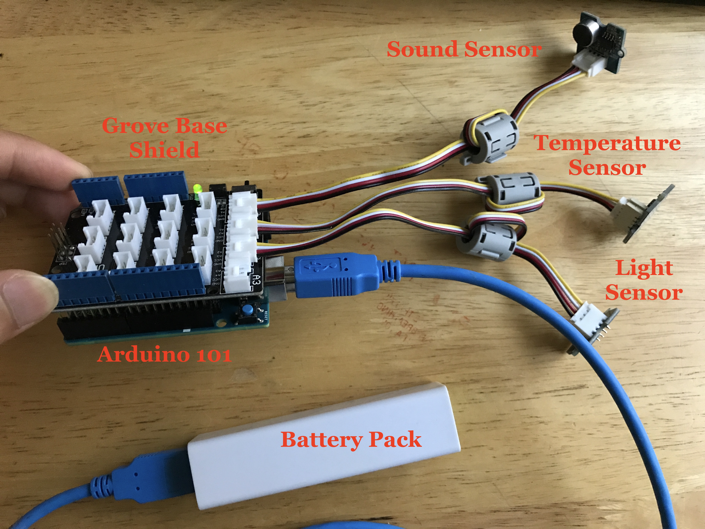

WaterWatch 2.0
----
Intel Hacks 2017

## Mission Statement and Goals
Streams are really important. They provide essential functions such as drinking
water, crop irrigation, recreation, habitat for aquatic ecosystems, and
hydroelectric power. The world of environmental monitoring, especially in
regards to citizen science
monitoring, is fairly labor intensive, time consuming, and often requires
expensive equipment and sensor kits. With Water Watch 2.0, we're looking to
ease the data collection process by creating a customizable solution that is
more accessible than traditional scientific equipment.  

WaterWatch 2.0 is able to wirelessly update data to a visual display on a
computer, which reduces the need for constant sensor supervision, data
documentation, and manual data entry. By increasing the ease with which we
understand surrounding stream environments, the better we are able to
understand the complex processes and cycles within our natural ecosystem. For
example, temperature fluctuations can have impacts on dissolved oxygen levels
in the water, which in turn dictates the insects and fish that inhabit the
stream.

## Installation and Requirements


#### Hardware

- Arudino 101
- Grove Sensor Starter Kit (Base Shield, temperature, light, sound sensors)
- USB battery pack
- USB cable
- Computer with Bluetooth Low Energy (BLE) capabilities

Make sure you have the sketch file `streamwatch.ino` downloaded onto the Arduino, and the Arduino
hooked up as shown in the picture below.



#### Software
You need git, npm, and node.js installed. You will also need the node modules listed in `package.json`

## Running our Demo

Start the Arduino with the sketch file loaded and move over to the computer.
```
$ git clone git@github.com:mlliou112/waterwatch2.0.git
$ cd waterwatch2.0
$ node enviro.js
scanning...
```

The server will be up and running searching for the bluetooth device with the correct name. The program will then print out the characteristics that it has found and tell you that it has subscribed for notifications of updates from the sensors.

Once subscribed, the website can be viewed at `localhost:3000`. You will see a description of our project and goals on the first part of the website, and three graphs corresponding to the sensor values on the Arduino in the "Data" section.

## Technology Details
The backend was written in [Node.js](https://nodejs.org/en/), using [Noble](https://github.com/sandeepmistry/noble) to simulate a BLE Central device. The data received on the server is pushed to the client over [socket.io](https://socket.io/) for real-time updates and the front-end was rendered with help of [bootstrap](http://getbootstrap.com/) and [d3.js](https://d3js.org/).

The Arduino uses bluetooth report the sensor values. It is programmed to only update values when the value has changes, and will only check every two seconds. This can be configured in the provided sketch file.

## Future Extensions
Additional sensors can be added to the Arduino, such as Dissolved Oxygen, or Flow Rate sensors to be placed inside the water. Furthermore, the range can be modified by transmitting the data over radio to a router and centralized on a website. It is also possible to monitor many streams at once with many IoT devices and create an aggregated view of all streams in the area.

We believe this project is a first step for the future of environmental monitors and citizen science that will improve reproducibility and cut costs.

## Acknowledgements

Thanks to Intel and Devpost for making this opportunity possible.
